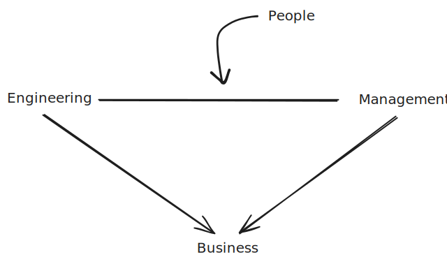

# The Role of a Manager

Source: https://frontendmasters.com/courses/intro-management/what-do-managers-do/

## What do Managers Do?

It depends.

As an engineering manager at a **fast growing startup** I spend most of my time **coding** and **hiring**.

> You are probably alone, doing the coding yourself.

As an engineering manager at a **mid sized company** I spend most of my time **mentoring** and doing **project management**.

> You are not probably hiring senior engineers because they tend to have bigger salaries, so maybe we are trying to grow quickly and you still need the junior and mid level engineers, so probably spend time mentoring and project management activities because the people on your team are not senior enough to do that themselves.

The role change from day to day, from week to week. And it depends on...

- The size of the team;
- Experience of the team;
- Scope;
- **Relation to business**: critical, with very eyes on it or in a "keep the lights on" part of the business;
- **Size of the company**: in large companies, you will spend time talking to a lot of partners, whereas in small company you will spend a lot of the time coding
- **Role of the team**: product team that build things for customers, or platform team where my customers are other engineers who work at the company;

A more broader question: **What are Engineering Managers responsible for?**

  

  Figure 1 - Everything you do will be in favor of the business

 

Sometimes you can't make people happy. When the business say you can't pay more, or if there is no room for a bigger role for example.

The challenging part of Engineering management is to make people happy while balancing all these different priorities and this does't change as you move up. At the end of the day the business pay you to operate your team efficiently, but your team is made of people and they might not care about the business as much.
